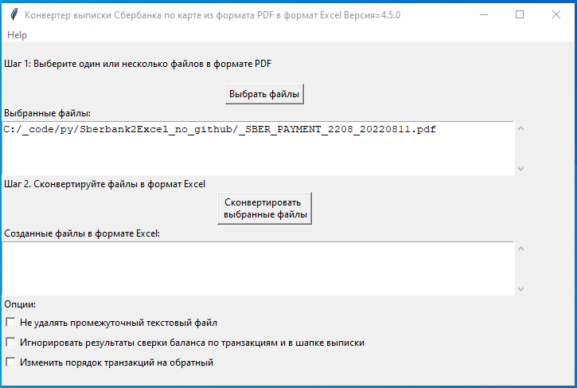

# Sberbank2Excel

Утилита для конвертации выписки Сбербанка по карте из формата PDF в формат Excel

**Автор:** ev2geny собака gmail.com

## Как пользоваться

### Подготовка
1. Скачать последнюю версию  **sberbankPDF2ExcelGUI.zip** https://github.com/Ev2geny/Sberbank2Excel/releases/latest 
1. Разархивировать ZIP файл в отдельную директорию и найти `sberbankPDF2ExcelGUI.bat`

### Конвертация 

**Шаг 1** Запустите `sberbankPDF2ExcelGUI.bat`

**Шаг 2** Выберите один или несколько файлов выписки Сбербанка по карте в формате PDF

**Шаг 3** Нажмите "Сконвертировать выбранные файлы"

**Результат:** утилита создаст файлы с расширением .xlsx 

## Обратная связь
Для сообщения об ошибках или пожеланиях по улучшению лучше всего воспользоваться функционалом системы github https://github.com/Ev2geny/Sberbank2Excel/issues

На общие темы начните дискуссию здесь https://github.com/Ev2geny/Sberbank2Excel/discussions

Либо напишите письмо автору: ev2geny собака gmail.com

## Как безопасно пересылать проблемный файл
В случае если происходит ошибка в конвертации выписки, разработчику потребуется доступ к поблемному файлу для исправления программы. 
Если нет возможности переслать разработчику изначальную выписку из соображений конфиденциальности, можно переслать анонимизированный промежуточный текстовый файл. Для этого надо сделать следующее
- При ошибке конвертации конвертер создаст промежуточный текстовый файл с расширением *.txt
- Удалите конфиденциальную информацию из этого текстового файла (номер карты и т.д.). Старайтесь удалять или менять как можно меньше информации. Воспользуйтесь [вот этой инструкцией](misc/Anonymisation%20instructions.png)
На выходе должно получиться что-то типа этого: [пример анонимизированного промежуточного текстового файла](misc/2107_Stavropol_format_anonymized_reduced.txt)

- Попытайтесь сконвертировать теперь уже анонимизированный текстовый файл используя всё тот же sberbankPDF2ExcelGUI (для этого на **Шаге 2** при выборе файлов надо разрешить выбор любых файлов)
- Убедитесь, что вы видите точно такое же сообщение об ошибке, как и при попытке конвертации PDF файла.
- Перешлите анонимизированный текстовый файл разработчику вместе с информацией об ошибке.
