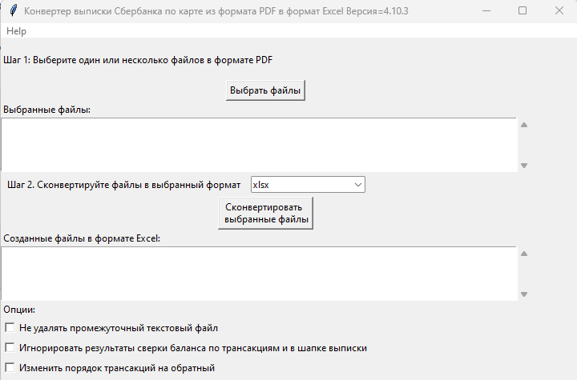

<!-- omit from toc -->
# Sberbank2Excel

Расширяемая утилита для конвертации выписки Сбербанка по карте из
формата PDF в формат Excel. (С возможностями расширения для выписок
других банков).

Утилита восполняет отсутствие возможности скачивания данных из Сбербанка
в формате CSV, либо в любом другом формате, пригодном для дальнейшей
аналитической обработки.

**Разработчик:** ev2geny собака gmail.com

**Содержание**

- [Функционал](#функционал)
- [Как пользоваться](#как-пользоваться)
  - [Подготовка](#подготовка)
  - [Конвертация](#конвертация)
- [ЧаВо](#чаво)
  - [Куда посылать донаты?](#куда-посылать-донаты)
  - [На каких Операционных Системах (ОС) работает утилита?](#на-каких-операционных-системах-ос-работает-утилита)
  - [Утилита не конвертирует / не поддерживает мою выписку. Что делать?](#утилита-не-конвертирует--не-поддерживает-мою-выписку-что-делать)
  - [Антивирус атакует утилиту и не даёт ей работать либо даже скачать. Что делать?](#антивирус-атакует-утилиту-и-не-даёт-ей-работать-либо-даже-скачать-что-делать)
- [Обратная связь](#обратная-связь)
- [Приложения](#приложения)
  - [Приложение А. Список поддерживаемых форматов](#приложение-а-список-поддерживаемых-форматов)
  - [Приложение Б. Как безопасно пересылать проблемный файл](#приложение-б-как-безопасно-пересылать-проблемный-файл)
  - [Приложение В. Запуск приложения из командной строки](#приложение-в-запуск-приложения-из-командной-строки)

## Функционал

-   Конвертация одного или многих файлов PDF - выписки за один раз
-   Поддерживает несколько форматов выписки. См. [Приложение А. Список
    поддерживаемых форматов](#приложение-а-список-поддерживаемых-форматов)
-   Легко расширяется для поддержки дополнительных форматов в том числе
    возможно и выписок из других банков (см.
    [CONTRIBUTING.md](CONTRIBUTING.md))
-   Автоматическое определение формата выписки
-   Верификация баланса по транзакциям и по шапке. Утилита вычисляет
    баланс по всем найденным транзакциям и сравнивает это число с
    балансом, вычисленным по информации в шапке выписки (к примеру
    `баланс_по_шапке = СУММА ПОПОЛНЕНИЙ - СУММА СПИСАНИЙ - СУММА СПИСАНИЙ БАНКА`).
    Если эти два числа не совпадают, то выписка по умолчанию не
    создаётся. Это даёт высокую вероятность того, что если Excel файл
    был создан, то конвертация прошла без ошибок.

## Как пользоваться

### Подготовка

1.  Скачайте [последнюю версию
    программы](https://github.com/Ev2geny/Sberbank2Excel/releases/latest)
2.  Разархивируйте ZIP файл в отдельную директорию и найдите
    `sberbankPDF2ExcelGUI.exe`

### Конвертация

**Шаг 1** Запустите `sberbankPDF2ExcelGUI.exe`

**Шаг 2** Выберите один или несколько файлов выписки Сбербанка по карте
в формате PDF

**Шаг 3** При необходимости измените формат выходного файла. 

**Шаг 4** Нажмите "Сконвертировать выбранные файлы"

**Результат:** утилита создаст файлы с расширением .xlsx

**Примечания:**

Опции **Не удалять промежуточный текстовый файл** и **Игнорировать
результаты сверки баланса по транзакциям и в шапке выписки**
используются в основном для отладки, сообщениях о проблемах или для
тестирования.

Опция **Изменить порядок трансакций на обратный** используется для того,
чтобы изменить порядок трансакций в Excel файле на обратный. Т.е. в этом
случае первая трансакция в PDF файле будет последней в Excel файле и
наоборот.

См. также [Приложение В. Запуск приложения из командной строки](#приложение-в-запуск-приложения-из-командной-строки)

## ЧаВо

### Куда посылать донаты?

Если вы пользуетесь программой Sberbank2Excel и она вам нравится, вы можете
рассмотреть возможность поддержать автора этой программы, сделав донат. Любая
поддержка будет приветствоваться автором и поможет ему сохранить мотивацию и
интерес к работе.

**Способы переслать донаты**

[YooMoney](https://yoomoney.ru/fundraise/wa347QPzZdU.230501) (МИР,
UnionPay, Mastercard, Visa, Maestro)

### На каких Операционных Системах (ОС) работает утилита?

-   Windows начиная с Windows 8.1 (на Windows 7 не работает!)

В дополнение к этому можно запускать утилиту на macOS и Linux, но в на данный
момент в [регулярных
релизах](https://github.com/Ev2geny/Sberbank2Excel/releases/latest)
исполняемого файла для этих ОС не создаётся. Поэтому надо либо создавать его
самостоятельно, либо запускать утилиту из среды Python (см. [инструкцию
разработчика](CONTRIBUTING.md).)

### Утилита не конвертирует / не поддерживает мою выписку. Что делать?

Перед релизом утилита тестируется на конвертацию всех поддерживаемых форматах
(см. [Приложение А. Список поддерживаемых форматов](#приложение-а-список-поддерживаемых-форматов)) 
на всех доступных автору вариантах выписки. Если на Вашей выписке утилита не
работает, либо если есть потребность добавить новый пока не поддерживаемый
формат выписки, то существуют следующие варианты. (Варианты отсортированы в
порядке возрастания сложности решения для Вас но одновременно в порядке
убывания рисков связанных с конфиденциальностью данных для Вас же):

1\. Попросить автора добавить поддержку вашего формата выписки. Для этого нужно выслать автору:  
-   pdf-вариант выписки

2\. Попросить автора добавить поддержку вашего формата выписки, выслав автору анонимизированные данные. Для этого потребуется выслать:  
-   Анонимизированный текстовый вариант выписки. См. [Приложение Б. Как безопасно пересылать проблемный файл](#приложение-б-как-безопасно-пересылать-проблемный-файл)
-   Анонимизированный скриншот выписки для целей дальнейшей документации. См. примеры [здесь](misc/format_examples)

3\.  Добавить новый формат выписки самостоятельно используюя [инструкцию разработчика](CONTRIBUTING.md).

### Антивирус атакует утилиту и не даёт ей работать либо даже скачать. Что делать?

Антивирусные программы пытаются определить вирусы по одним им известным
алгоритмам. Часто они блокируют всё, что им кажется подозрительным, включая
Sberbank2Excel. Одновременно с этим все известные автору производители
антивирусных программ позволяют выслать им подозрительный файл для более
пристального изучения, после чего разблокируют его в следующем апдейте базы
данных вирусов. К примеру для Microsoft Windows Defender файл надо посылать
[сюда](https://www.microsoft.com/en-us/wdsi/filesubmission). Для Symantec
[сюда](https://symsubmit.symantec.com/). Автор как правило "согласовывает"
каждый новый релиз как минимум с Microsoft Windows Defender. Таким образом если
антивирусная программа, установленная на Вашем компьютере атакует
Sberbank2Excel, то возможны следующие варианты действия:

-   Согласовать вопросы с производителем антивируса самостоятельно
-   Попросить это сделать автора. Автору потребуется информация о типе
    антивирусной программы, атакующей утилиту.

## Обратная связь

Для сообщения об ошибках или пожеланиях по улучшению лучше всего
воспользоваться [функционалом системы github](https://github.com/Ev2geny/Sberbank2Excel/issues)

На общие темы начните дискуссию [здесь](https://github.com/Ev2geny/Sberbank2Excel/discussions)

Либо напишите письмо разработчику: ev2geny собака gmail.com

## Приложения
### Приложение А. Список поддерживаемых форматов

-----------------------------------------------------------------------------------------------------------
| Банк     | Формат  | Описание | MasterCard | VISA | Трансакции в иностранной валюте | Известные проблемы |
|----------|---------|----------|------------|------|---------------------------------|--------------------|
| Сбербанк | [SBER_DEBIT_2005](/misc/format_examples/SBER_DEBIT_2005.png) | Дебетовая карта образца мая 2020 года  | OK  | ???  |ОК  |   |
| Сбербанк | [SBER_DEBIT_2107](/misc/format_examples/SBER_DEBIT_2107.png) | Дебетовая карта образца июля 2021 года  | OK | ???  | ОК |   |
| Сбербанк | [SBER_CREDIT_2110](/misc/format_examples/SBER_CREDIT_2110.png) | Кредитная карта образца октября 2021 года (ТДВФН) | ???  | OK   | OK? | [13](https://github.com/Ev2geny/Sberbank2Excel/issues/13) |
| Сбербанк | [SBER_PAYMENT_2208](/misc/format_examples/SBER_PAYMENT_2208.png)| Платёжный счёт образца августа 2022 года (ТДВФН)  | НП         | НП   | НП? |
| Сбербанк | [SBER_DEBIT_2212](/misc/format_examples/SBER_DEBIT_2212.png) | Дебетовая карта образца декабря 2022 года | OK         | ???  | ОК  |
| Сбербанк | [SBER_PAYMENT_2212](/misc/format_examples/SBER_PAYMENT_2212.png) | Платёжный счёт образца декабря 2022 года | НП | НП | ОК |
| Сбербанк | [SBER_SAVING_2303](/misc/format_examples/SBER_SAVING_2303.png) | Выписка из лицевого счёта по вкладу «Сберегательный счет» образца марта 2023 года (ТДВФН). Также должно работать с другими типами сберегательных счетов (Активное долголетие и т.д.) | НП  | НП   | НП |                                                                |
| Сбербанк | [SBER_DEBIT_2303_CHELYABINSK](/misc/format_examples/SBER_DEBIT_2303_CHELYABINSK.png) | История операций по дебетовой карте за период. Образца марта 2023 года (ТДВФН). ???Челябинск??  | ОК         | ?    | НЕТ||
| Сбербанк | [SBER_PAYMENT_2406](/misc/format_examples/SBER_PAYMENT_2406.png)| Платёжный счёт образца июня 2024 года   | НП         | НП   | ОК| [43](https://github.com/Ev2geny/Sberbank2Excel/issues/43) |
| Сбербанк | [SBER_PAYMENT_2407](/misc/format_examples/SBER_PAYMENT_2407.png)| Платёжный счёт образца июля 2024 года  | НП | НП   | ОК| [52](https://github.com/Ev2geny/Sberbank2Excel/issues/52)|
| Сбербанк | [SBER_SAVING_2407](/misc/format_examples/SBER_SAVING_2407.png)| Выписка из лицевого счёта по вкладу «Накопительный счет» образца июля 2024 года (ТДВФН). | НП| НП   | НП|
| Сбербанк | [SBER_DEBIT_2408](/misc/format_examples/SBER_DEBIT_2408.png)| Дебетовая карта образца августа 2024 года  | OK         | ???  | ОК   |  |
| Сбербанк | [SBER_CREDIT_2409](/misc/format_examples/SBER_CREDIT_2409.png)| Кредитная карта образца сентября 2024 года  | НП|НП  | ОК? |[51](https://github.com/Ev2geny/Sberbank2Excel/issues/51), [54](https://github.com/Ev2geny/Sberbank2Excel/issues/54), [55](https://github.com/Ev2geny/Sberbank2Excel/issues/55)  |

**Легенда и сокращения**

ОК - поддерживается

??? - неизвестно (не протестировано)

ОК? - точно неизвестно (не протестировано) но вроде должно работать

НП - не применимо

ТДВФН - точная дата выпуска формата неизвестна

### Приложение Б. Как безопасно пересылать проблемный файл

В случае если происходит ошибка в конвертации выписки, либо есть потребность
добавить новый формат, разработчику потребуется доступ к проблемной/новой
выписке для исправления программы. Если из соображений конфиденциальности нет
возможности переслать разработчику изначальную выписку, можно переслать
анонимизированный промежуточный текстовый файл. Для этого надо сделать
следующее:

-   При ошибке конвертации конвертер создаст промежуточный текстовый файл с
    расширением .txt. Этот файл содержит текстовую информацию из pdf-выписки,
    которая в дальнейшем должна была быть использована для создания Excel -
    файла. Однако не вся текстовая информация используется для создания Excel
    файла. Задача состоит в том чтобы удалить неиспользуемую конфиденциальную
    информацию либо заменить используемую конфиденциальную информацию, но
    сделать это таким образом чтобы конвертер всё еще распознавал бы структуру
    файла и смог бы выполнить проверку вычисления сумм транзакций.
    [Инструкция](misc/Anonymisation%20instructions.png) показывает что можно
    удалять, что можно заменять, а что нужно оставить без изменений.
-    Используйте текстовый редактор и
    [инструкцию](misc/Anonymisation%20instructions.png) чтобы удалить
    конфиденциальную информацию из промежуточного текстового файла (номер
    карты, фамилию, имя и т.д.). Т.к. для конвертер различает символ табуляции
    и пробелы, то рекомендуется использовать текстовый редактор, который
    показывает символы табуляции чтобы случайно не удалить их. Рекомендуемый
    текстовый редактор для этих целей:
    [Notepad++](https://notepad-plus-plus.org/)
-   *Старайтесь удалять или менять как можно меньше информации*. На выходе
    должно получиться что-то типа этого: [пример анонимизированного промежуточного текстового файла](misc/_SBER_DEBIT_2107_anonymized_reduced.txt)
-   Попытайтесь сконвертировать теперь уже анонимизированный текстовый файл
    используя всё тот же sberbankPDF2ExcelGUI (для этого на **Шаге 2** при
    выборе файлов надо разрешить выбор любых файлов, а не только .pdf)
-   Убедитесь, что при попытке конвертации анонимизированного текстового файла
    конвертер выдаёт такое же сообщение об ошибке, как и при попытке
    конвертации PDF файла.
-   Перешлите анонимизированный текстовый файл разработчику (ev2geny собака
    gmail.com) вместе с информацией об ошибке.

### Приложение В. Запуск приложения из командной строки

Для запуска приложения из командной строки надо использовать модуль
[sberbankPDF2Excel.py](/core/sberbankPDF2Excel.py)

    usage: sberbankPDF2Excel.py [-h] [-o OUTPUT_EXCEL_FILE_NAME] [-b]
                                [-f {SBER_DEBIT_2107,SBER_DEBIT_2005,SBER_CREDIT_2107,SBER_PAYMENT_2208}] [-t {xlsx,csv}] [-i]
                                input_file_name

    Конвертация выписки банка из формата PDF или из промежуточного текстового файла в формат Excel или CSV.

    positional arguments:
      input_file_name       Файла для конвертации

    optional arguments:
      -h, --help            show this help message and exit
      -o OUTPUT_EXCEL_FILE_NAME, --output OUTPUT_EXCEL_FILE_NAME
                            Имя файла (без расшмрения) который будет создан в формате Excel или CSV
      -b, --balcheck        Игнорировать результаты сверки баланса по транзакциям и в шапке выписки
      -f {SBER_DEBIT_2107,SBER_DEBIT_2005,SBER_CREDIT_2107,SBER_PAYMENT_2208}, --format {SBER_DEBIT_2107,SBER_DEBIT_2005,SBER_CREDIT_2107,SBER_PAYMENT_2208}
                            Формат выписки. Если не указан, определяется автоматически
      -t {xlsx,csv}, --type {xlsx,csv}
                            Тип создаваемого файла
      -i, --interm          Не удалять промежуточный текстовый файт

На данный момент эта утилита не включена в [выпускаемые релизы](https://github.com/Ev2geny/Sberbank2Excel/releases/latest). 
Поэтому необходимо либо сгенерировать её самостоятельно либо запускать из среды Python (см. [CONTRIBUTING.md](CONTRIBUTING.md))
