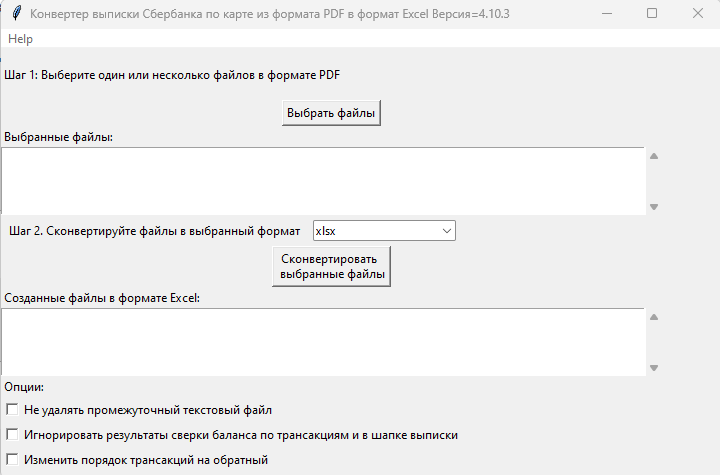

= Sberbank2Excel
ev2geny собака gmail.com
:toc:
:toclevels: 3
:sectnums:

Расширяемая утилита для конвертация различных вариантов выписок
Cбербанка из формата PDF в формат Excel.

Утилита восполняет отсутствие возможности скачивания данных из Сбербанка
в формате CSV, либо в любом другом формате, пригодном для дальнейшей
аналитической обработки.

.Sberbank2Excel.PNG

*Разработчик:* ev2geny собака gmail.com

*Содержание*

:toc:
:toclevels: 3

== Функционал

* Конвертация одного или многих файлов PDF - выписки за один раз
* Работает на Windows, а начиная с релиза 5.0.0 также доступна
относительно простая установка на macOS и Linux
* Поддерживает несколько форматов выписки. См.
link:#приложение-а-список-поддерживаемых-форматов[Приложение А. Список
поддерживаемых форматов]
* Легко расширяется для поддержки дополнительных форматов в том числе
возможно и выписок из других банков (см. CONTRIBUTING.md)
* Автоматическое определение формата выписки
* Верификация баланса по транзакциям и по шапке. Утилита вычисляет
баланс по всем найденным транзакциям и сравнивает это число с балансом,
вычисленным по информации в шапке выписки (к примеру
`баланс++_++по++_++шапке = СУММА ПОПОЛНЕНИЙ - СУММА СПИСАНИЙ - СУММА СПИСАНИЙ БАНКА`).
Если эти два числа не совпадают, то выписка по умолчанию не создаётся.
Это даёт высокую вероятность того, что если Excel файл был создан, то
конвертация прошла без ошибок.

== Установка

=== Опция 1: Установка готового файла (пока что доступна только для Windows)

[arabic]
. Скачайте https://github.com/Ev2geny/Sberbank2Excel/releases/latest[ZIP
- архив последней версии программы]
. Разархивируйте ZIP файл в отдельную директорию и найдите
`sberbank2Excel.exe`

=== Опция 2: Более сложная установка (должна работать на всех платформах)

См. <<Приложение Г. Установка используя инструменты python из исходного кода.>>

== Конвертация выписки банка.

*Шаг 1* Запустите `sberbank2Excel.exe` двойным щелчком мыши. +
Прим.: если был использовать способ установки, описанный в
link:#приложение-г-установка-используя-инструменты-python-из-исходного-кода[Приложении
Г] то необходимо из командной строки (из любой директории) ввести
команду `sberbankExcel`

_Результат:_ приложение запустится в режиме Графического Интерфейса
Пользователя (ГИП)

*Шаг 2* Выберите один или несколько файлов выписки Сбербанка по карте в
формате PDF

*Шаг 3* При необходимости измените формат выходного файла.

*Шаг 4* Нажмите "`Сконвертировать выбранные файлы`"

*Результат:* утилита создаст файлы с расширением .xlsx

*Примечания:*

* Опции *Не удалять промежуточный текстовый файл* и *Игнорировать
результаты сверки баланса по транзакциям и в шапке выписки* используются
в основном для отладки, сообщениях о проблемах или для тестирования.
* Опция *Изменить порядок трансакций на обратный* используется для того,
чтобы изменить порядок трансакций в Excel файле на обратный. Т.е. в этом
случае первая трансакция в PDF файле будет последней в Excel файле и
наоборот.

См. также
link:#приложение-в-использование-утилиты-в-режиме-командной-строки[Приложение
В. Запуск приложения из командной строки]

== ЧаВо

=== Куда посылать донаты?

Если вы пользуетесь программой Sberbank2Excel и она вам нравится, вы
можете рассмотреть возможность поддержать автора этой программы, сделав
донат. Любая поддержка будет приветствоваться автором и поможет ему
сохранить мотивацию и интерес к работе.

*Способы переслать донаты*

https://yoomoney.ru/fundraise/wa347QPzZdU.230501[YooMoney] (МИР,
UnionPay, Mastercard, Visa, Maestro)

=== На каких Операционных Системах (ОС) работает утилита?

* Windows начиная с Windows 8.1 (на Windows 7 не работает!)
* При использовании вариант установки, описанного в
link:#приложение-г-установка-используя-инструменты-python-из-исходного-кода[Приложении
Г] в дополнение к этому можно запускать утилиту на macOS и Linux.

=== Утилита не конвертирует / не поддерживает мою выписку. Что делать?

Перед релизом утилита тестируется на конвертацию всех поддерживаемых
форматах (см.
link:#приложение-а-список-поддерживаемых-форматов[Приложение А. Список
поддерживаемых форматов]) на всех доступных автору вариантах выписки.
Если на Вашей выписке утилита не работает, либо если есть потребность
добавить новый пока не поддерживаемый формат выписки, то существуют
следующие варианты. (Варианты отсортированы в порядке возрастания
сложности решения для Вас но одновременно в порядке убывания рисков
связанных с конфиденциальностью данных для Вас же):

{empty}1. Попросить автора добавить поддержку вашего формата выписки.
Для этого нужно выслать автору: +
- pdf-вариант выписки

{empty}2. Попросить автора добавить поддержку вашего формата выписки,
выслав автору анонимизированные данные. Для этого потребуется выслать: +
- Анонимизированный текстовый вариант выписки. См.
link:#приложение-б-как-безопасно-пересылать-проблемный-файл[Приложение
Б. Как безопасно пересылать проблемный файл] - Анонимизированный
скриншот выписки для целей дальнейшей документации. См. примеры
link:docs/format_examples[здесь]

{empty}3. Добавить новый формат выписки самостоятельно используюя
link:CONTRIBUTING.md[инструкцию разработчика].

=== Антивирус атакует утилиту и не даёт ей работать либо даже скачать. Что делать?

Антивирусные программы пытаются определить вирусы по одним им известным
алгоритмам. Часто они блокируют всё, что им кажется подозрительным,
включая Sberbank2Excel. Одновременно с этим все известные автору
производители антивирусных программ позволяют выслать им подозрительный
файл для более пристального изучения, после чего разблокируют его в
следующем апдейте базы данных вирусов. К примеру для Microsoft Windows
Defender файл надо посылать
https://www.microsoft.com/en-us/wdsi/filesubmission[сюда]. Для Symantec
https://symsubmit.symantec.com/[сюда]. Автор как правило
"`согласовывает`" каждый новый релиз как минимум с Microsoft Windows
Defender. Таким образом если антивирусная программа, установленная на
Вашем компьютере атакует Sberbank2Excel, то возможны следующие варианты
действия:

* Согласовать вопросы с производителем антивируса самостоятельно
* Попросить это сделать автора. Автору потребуется информация о типе
антивирусной программы, атакующей утилиту.

== Обратная связь

Для сообщения об ошибках или пожеланиях по улучшению лучше всего
воспользоваться
https://github.com/Ev2geny/Sberbank2Excel/issues[функционалом системы
github]

На общие темы начните дискуссию
https://github.com/Ev2geny/Sberbank2Excel/discussions[здесь]

Либо напишите письмо разработчику: ev2geny собака gmail.com

== Приложения

=== Приложение А. Список поддерживаемых форматов

'''''

[width="100%",cols="10%,9%,10%,12%,6%,33%,20%",options="header",]
|===
|Банк |Формат |Описание |MasterCard |VISA |Трансакции в иностранной
валюте |Известные проблемы
|Сбербанк
|link:/docs/format_examples/SBER_DEBIT_2005.png[SBER++_++DEBIT++_++2005]
|Дебетовая карта образца мая 2020 года |OK |??? |ОК |

|Сбербанк
|link:/docs/format_examples/SBER_DEBIT_2107.png[SBER++_++DEBIT++_++2107]
|Дебетовая карта образца июля 2021 года |OK |??? |ОК |

|Сбербанк
|link:/docs/format_examples/SBER_CREDIT_2110.png[SBER++_++CREDIT++_++2110]
|Кредитная карта образца октября 2021 года (ТДВФН) |??? |OK |OK?
|https://github.com/Ev2geny/Sberbank2Excel/issues/13[13]

|Сбербанк
|link:/docs/format_examples/SBER_PAYMENT_2208.png[SBER++_++PAYMENT++_++2208]
|Платёжный счёт образца августа 2022 года (ТДВФН) |НП |НП |НП? |

|Сбербанк
|link:/docs/format_examples/SBER_DEBIT_2212.png[SBER++_++DEBIT++_++2212]
|Дебетовая карта образца декабря 2022 года |OK |??? |ОК |

|Сбербанк
|link:/docs/format_examples/SBER_PAYMENT_2212.png[SBER++_++PAYMENT++_++2212]
|Платёжный счёт образца декабря 2022 года |НП |НП |ОК |

|Сбербанк
|link:/docs/format_examples/SBER_SAVING_2303.png[SBER++_++SAVING++_++2303]
|Выписка из лицевого счёта по вкладу «Сберегательный счет» образца марта
2023 года (ТДВФН). Также должно работать с другими типами сберегательных
счетов (Активное долголетие и т.д.) |НП |НП |НП |

|Сбербанк
|link:/docs/format_examples/SBER_DEBIT_2303_CHELYABINSK.png[SBER++_++DEBIT++_++2303++_++CHELYABINSK]
|История операций по дебетовой карте за период. Образца марта 2023 года
(ТДВФН). ???Челябинск?? |ОК |? |НЕТ |

|Сбербанк
|link:/docs/format_examples/SBER_PAYMENT_2406.png[SBER++_++PAYMENT++_++2406]
|Платёжный счёт образца июня 2024 года |НП |НП |ОК
|https://github.com/Ev2geny/Sberbank2Excel/issues/43[43]

|Сбербанк
|link:/docs/format_examples/SBER_PAYMENT_2407.png[SBER++_++PAYMENT++_++2407]
|Платёжный счёт образца июля 2024 года |НП |НП |ОК
|https://github.com/Ev2geny/Sberbank2Excel/issues/52[52]

|Сбербанк
|link:/docs/format_examples/SBER_SAVING_2407.png[SBER++_++SAVING++_++2407]
|Выписка из лицевого счёта по вкладу «Накопительный счет» образца июля
2024 года (ТДВФН). |НП |НП |НП |

|Сбербанк
|link:/docs/format_examples/SBER_DEBIT_2408.png[SBER++_++DEBIT++_++2408]
|Дебетовая карта образца августа 2024 года |OK |??? |ОК |

|Сбербанк
|link:/docs/format_examples/SBER_CREDIT_2409.png[SBER++_++CREDIT++_++2409]
|Кредитная карта образца сентября 2024 года |НП |НП |ОК?
|https://github.com/Ev2geny/Sberbank2Excel/issues/51[51],
https://github.com/Ev2geny/Sberbank2Excel/issues/54[54],
https://github.com/Ev2geny/Sberbank2Excel/issues/55[55]

|Сбербанк
|link:/docs/format_examples/SBER_DEBIT_2510.png[SBER++_++DEBIT++_++2510]
|Дебетовая карта образца октября 2025 года |НП |НП |ОК? |

|Сбербанк
|link:/docs/format_examples/SBER_PAYMENT_2510.png[SBER++_++PAYMENT++_++2510]
|Платёжный счёт образца октября 2025 года |НП |НП |ОК |

|Сбербанк
|link:/docs/format_examples/SBER_CREDIT_2511.png[SBER++_++CREDIT++_++2511]
|Кредитная карта образца ноября 2025 года |НП |НП |ОК? |
|===

*Легенда и сокращения*

ОК - поддерживается

??? - неизвестно (не протестировано)

ОК? - точно неизвестно (не протестировано) но вроде должно работать

НП - не применимо

ТДВФН - точная дата выпуска формата неизвестна

=== Приложение Б. Как безопасно пересылать проблемный файл

В случае если происходит ошибка в конвертации выписки, либо есть
потребность добавить новый формат, разработчику потребуется доступ к
проблемной/новой выписке для исправления программы. Если из соображений
конфиденциальности нет возможности переслать разработчику изначальную
выписку, можно переслать анонимизированный промежуточный текстовый файл.
Для этого надо сделать следующее:

* При ошибке конвертации конвертер создаст промежуточный текстовый файл
с расширением .txt. Этот файл содержит текстовую информацию из
pdf-выписки, которая в дальнейшем должна была быть использована для
создания Excel - файла. Однако не вся текстовая информация используется
для создания Excel файла. Задача состоит в том чтобы удалить
неиспользуемую конфиденциальную информацию либо заменить используемую
конфиденциальную информацию, но сделать это таким образом чтобы
конвертер всё еще распознавал бы структуру файла и смог бы выполнить
проверку вычисления сумм транзакций.
link:docs/Anonymisation%20instructions.png[Инструкция] показывает что
можно удалять, что можно заменять, а что нужно оставить без изменений.
*  Используйте текстовый редактор и
link:docs/Anonymisation%20instructions.png[инструкцию] чтобы удалить
конфиденциальную информацию из промежуточного текстового файла (номер
карты, фамилию, имя и т.д.). Т.к. для конвертер различает символ
табуляции и пробелы, то рекомендуется использовать текстовый редактор,
который показывает символы табуляции чтобы случайно не удалить их.
Рекомендуемый текстовый редактор для этих целей:
https://notepad-plus-plus.org/[Notepad{plus}{plus}]
* _Старайтесь удалять или менять как можно меньше информации_. На выходе
должно получиться что-то типа этого:
link:docs/_SBER_DEBIT_2107_anonymized_reduced.txt[пример
анонимизированного промежуточного текстового файла]
* Попытайтесь сконвертировать теперь уже анонимизированный текстовый
файл используя всё тот же sberbank2Excel (для этого на *Шаге 2* при
выборе файлов надо разрешить выбор любых файлов, а не только .pdf)
* Убедитесь, что при попытке конвертации анонимизированного текстового
файла конвертер выдаёт такое же сообщение об ошибке, как и при попытке
конвертации PDF файла.
* Перешлите анонимизированный текстовый файл разработчику (ev2geny
собака gmail.com) вместе с информацией об ошибке.

=== Приложение В. Использование утилиты в режиме командной строки

Помимо работы в рижиме Графического Интерфейса Пользователя (ГИП)
утилита поддерживает режим работы из командной строки. +
Для этого надо запускать утилиту из командной строки и указать и задать
один или более аргументов. Например:

....
sberbank2Excel -h
....

Если был использован способ установки, описанный в
link:#приложение-г-установка-используя-инструменты-python-из-исходного-года[Приложение
Г. Установка используя инструменты python из исходного года.] то команду
`sberbank2Excel` можно запускать из любой директории.

Подробную инструкцию использования приложения из командной строки можно
получить запустив её с аргументом -h

Для этого из командной строки небходимо ввести команду:

....
sberbank2Excel -h
....

....
usage: sberbankPDF2Excel [-h] [-o OUTPUT_EXCEL_FILE_NAME] [-b]
                        [-f {SBER_DEBIT_2107,SBER_DEBIT_2005,SBER_CREDIT_2107,SBER_PAYMENT_2407,SBER_PAYMENT_2406,SBER_PAYMENT_2212,SBER_PAYMENT_2208,SBER_DEBIT_2212,SBER_DEBIT_2408,SBER_SAVING_2303,SBER_SAVING_2407,SBER_DEBIT_2303_CHELYABINSK,SBER_CREDIT_2409}]
                        [-t {xlsx,csv}] [-r] [-i]
                        input_file_name

Конвертация выписки банка из формата PDF или из промежуточного текстового файла в формат Excel или CSV.

positional arguments:
input_file_name       Файл для конвертации

options:
-h, --help            show this help message and exit
-o OUTPUT_EXCEL_FILE_NAME, --output OUTPUT_EXCEL_FILE_NAME
                        Имя файла (без расшмрения) который будет создан в формате Excel или CSV
-b, --balcheck        Игнорировать результаты сверки баланса по транзакциям и в шапке выписки
-f {SBER_DEBIT_2107,SBER_DEBIT_2005,SBER_CREDIT_2107,SBER_PAYMENT_2407,SBER_PAYMENT_2406,SBER_PAYMENT_2212,SBER_PAYMENT_2208,SBER_DEBIT_2212,SBER_DEBIT_2408,SBER_SAVING_2303,SBER_SAVING_2407,SBER_DEBIT_2303_CHELYABINSK,SBER_CREDIT_2409}, --format {SBER_DEBIT_2107,SBER_DEBIT_2005,SBER_CREDIT_2107,SBER_PAYMENT_2407,SBER_PAYMENT_2406,SBER_PAYMENT_2212,SBER_PAYMENT_2208,SBER_DEBIT_2212,SBER_DEBIT_2408,SBER_SAVING_2303,SBER_SAVING_2407,SBER_DEBIT_2303_CHELYABINSK,SBER_CREDIT_2409}
                        Формат выписки. Если не указан, определяется автоматически
-t {xlsx,csv}, --type {xlsx,csv}
                        Тип создаваемого файла
-r, --reverse         Изменить порядок транзакций на обратный
-i, --interm          Не удалять промежуточный текстовый файт
....

=== Приложение Г. Установка используя инструменты python из исходного кода.

Данная установка слегка более сложная, но должна работать для любой
среды (Windows, macOS, Linux)

==== Вариант "`Изначальная установка`"

[arabic]
. Установите
https://docs.astral.sh/uv/getting-started/installation/#installation-methods[uv]
из командной строки.
+
для *Windows*
+
....
powershell -ExecutionPolicy ByPass -c "irm https://astral.sh/uv/install.ps1 | iex"
....
+
либо
+
....
winget install --id=astral-sh.uv  -e
....
+
для *macOS* и *Linux*
+
Используйте curl:
+
....
curl -LsSf https://astral.sh/uv/install.sh | sh
....
+
Либо wget
+
....
wget -qO- https://astral.sh/uv/install.sh | sh
....
. Проверьте установку uv. +
`uv -V` Результат должен быть примерно такой:
+
....
uv 0.9.5 (d5f39331a 2025-10-21)
....
. Установите Sberbank2Excel из исходного года, использую uv:
+
....
uv tool install git+https://github.com/Ev2geny/Sberbank2Excel.git
....
. Убедитесь, что установка прошла успешно, для этого запустите
приложение из командной строки в режиме командной строки
+
....
sberbank2Excel -h
....
. Попробуйте запустить пиложение из командной строки в графическом
режиме
+
....
sberbank2Excel
....
+
Прим.: в некоторых случаях пользователи сообщают о
https://github.com/Ev2geny/Sberbank2Excel/issues/74[проблемах запуска
программы в режиме ГИП]. В этом случае придётся использовать программу в
режиме командной строки, как описано в
link:#приложение-в-использование-утилиты-в-режиме-командной-строки[Приложении
В.]

===== Вариант "`Апгрейд существующей установки до новой версии`"

Если со времени изначальной установки вышла новая версия Sberbank2Excel,
то изначальную установку можно обновить используя команду

....
uv tool upgrade sberbank2Excel
....
